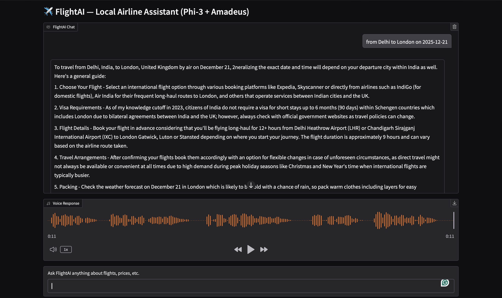
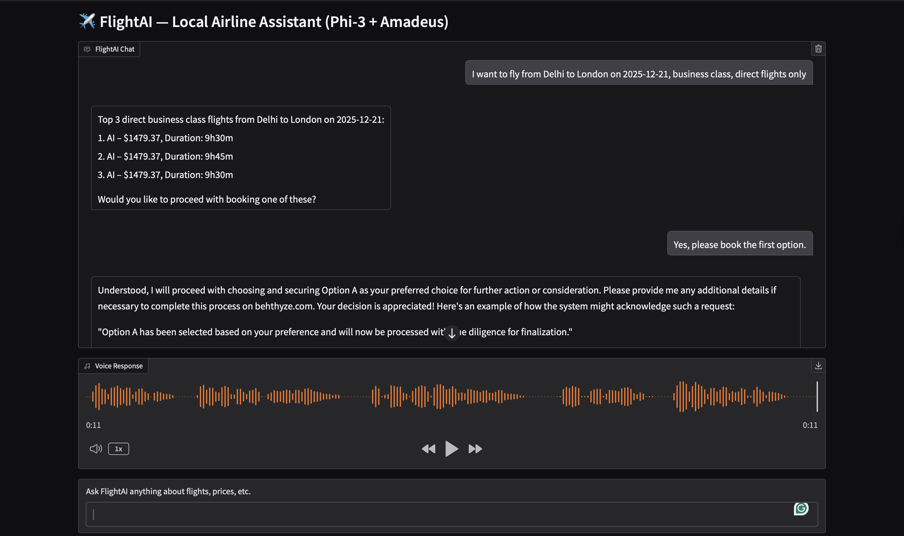
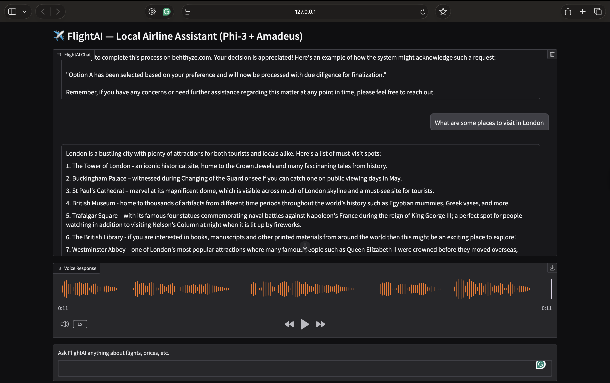
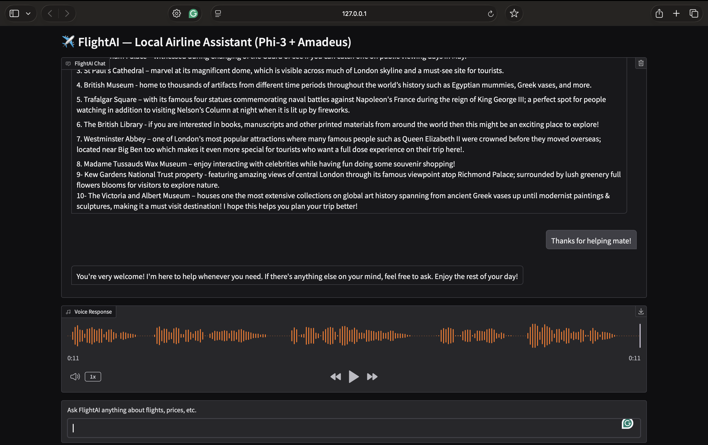
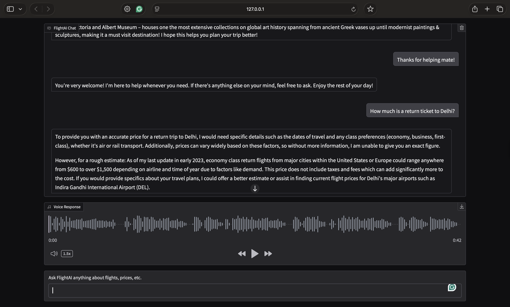

# FlightAI – AI-Powered Airline Assistant

FlightAI is a **polite, concise, step-wise airline assistant** that helps users search for flights, fetch ticket prices, and assist with booking. It integrates **local fallback data** and **real-time flight prices** using the Amadeus API. The system is designed to keep responses **short, accurate, and user-friendly**, while maintaining a **step-wise workflow** for flight inquiries and bookings.

---

## **Features**

1. **Flight Search & Price Fetching**

   * Fetches real-time flight options via **Amadeus API**.
   * Supports filtering by:

     * Origin & destination
     * Travel date
     * Travel class (Economy, Business)
     * Direct flights only
   * Shows **top 3 flight options** with price and duration.

2. **Step-wise Booking Flow**

   * First, displays flight options and prices.
   * Only after showing prices, asks for payment details or visa info.
   * Keeps all responses **short (1–2 sentences) and polite**.

3. **Fallback Local Ticket Prices**

   * Uses **SQLite database** for local ticket price lookup.
   * Useful if Amadeus API is unavailable or for demo purposes.

4. **Voice Responses (Optional)**

   * Text-to-speech functionality for assistant replies.

5. **Image Responses (Optional)**

   * Generates visual depictions of destinations.

6. **Open-Source Model Support**

   * Can integrate with **phi3-mini** locally.
   * Uses **step-wise prompting** to maintain context.

---

## **Project Structure**

```
FlightsAI/
│
├─ app/
│   ├─ main.py              # Entry point, Gradio UI
│   ├─ chat.py              # Main chat logic, step-wise handling
│   ├─ tools.py             # Flight API & SQLite helper functions
│   ├─ phi3_handler.py      # Local LLM model wrapper
│   └─ config.py            # API keys, DB paths, constants
│
├─ db/
│   └─ prices.db            # SQLite local ticket prices (optional)
│
├─ requirements.txt         # Python dependencies
└─ README.md                # Project documentation
```

---

## **Installation**

1. **Clone the repository**

```bash
git clone https://github.com/Abhishek0914/FlightAI---AI-powered-Airline-Assistant
cd FlightAI---AI-powered-Airline-Assistant
```

2. **Create a virtual environment**

```bash
conda create -n flightai python=3.10
conda activate flightai
```

3. **Install dependencies**

```bash
pip install -r requirements.txt
```

4. **Set up environment variables**

Create a `.env` file:

```
AMADEUS_CLIENT_ID=your_amadeus_client_id
AMADEUS_CLIENT_SECRET=your_amadeus_client_secret
OPENAI_API_KEY=your_openai_key (optional if using Phi3-mini)
```

5. **Prepare SQLite database** (optional)

```sql
CREATE TABLE prices (
    city TEXT PRIMARY KEY,
    price REAL
);
```

---

## **Usage**

1. **Run the app**

```bash
python app/main.py
```

2. **Open in browser**
   The Gradio UI will open in-browser with:

   * Chat interface
   * Optional image panel
   * Optional voice panel

3. **Example Queries**

   * Flight search:
     `I want to fly from Delhi to London on 2025-12-21, business class, direct flights only.`
   * Ticket price lookup:
     `What’s the ticket price to Paris?`
   * Booking flow:
     After receiving flight options, respond:
     `Yes, book the first option.`

4. **Example Output**

   #Demo:
    
    
    
    
    

---

## **Step-wise Flow**

| Step | Action                     | Response                                                  |
| ---- | -------------------------- | --------------------------------------------------------- |
| 1    | User asks for flight price | Fetch top 3 flights using API                             |
| 2    | Display options            | Assistant asks: “Would you like to proceed with booking?” |
| 3    | User confirms              | Ask for **full name** and **payment details**             |
| 4    | Booking confirmed          | Display final confirmation                                |

---

## **Tools & APIs**

1. **Amadeus Flight Offers API** – Real-time flight search

   * Requires `client_id` & `client_secret`
   * Supports filters: travel class, non-stop, number of results

2. **SQLite** – Local fallback ticket prices

3. **Local LLM (phi3-mini)** – Optional for AI-generated chat responses

4. **Gradio** – Web-based chat interface

---

## **Tips & Best Practices**

* Keep **chat history limited** to last 5–10 messages to avoid context drift.
* Do not mix unrelated topics in the same session to maintain relevance.
* Ensure **Amadeus token** is valid; regenerate if expired.
* Increase **timeout** for local LLM responses if running on M2 Mac (`timeout=120s`).

---

## **Future Improvements**

* Multi-city flight searches
* Multi-language support
* Seat selection and upgrade options
* Payment gateway integration
* Better error handling for API failures

